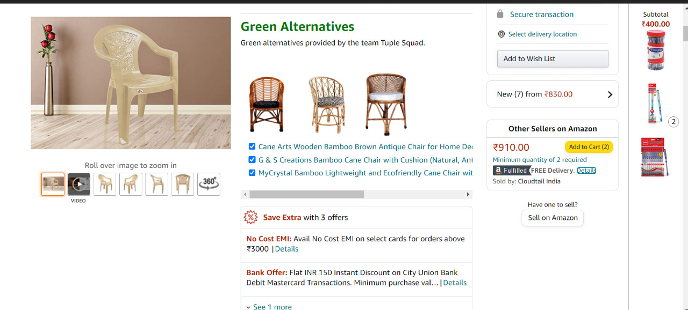
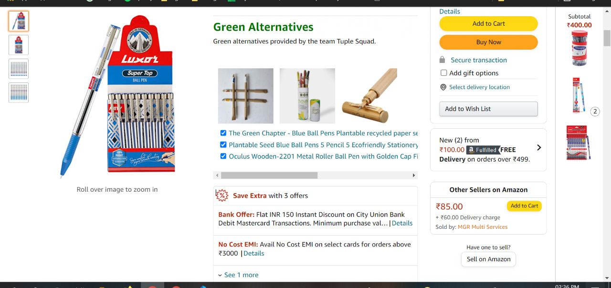
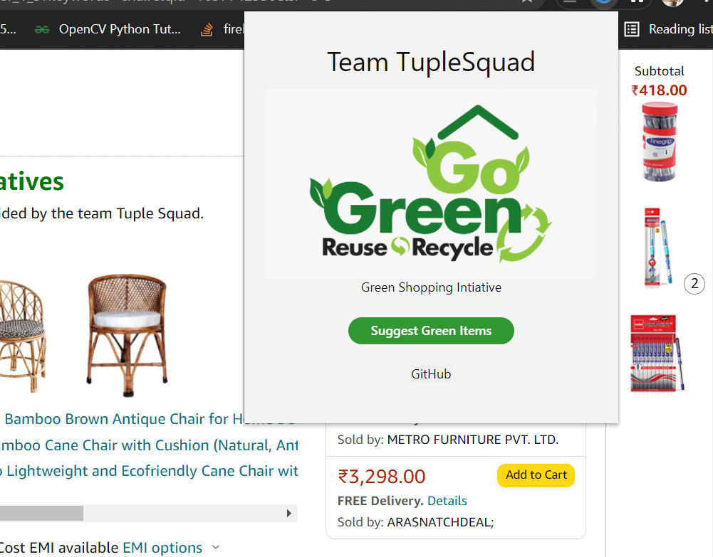
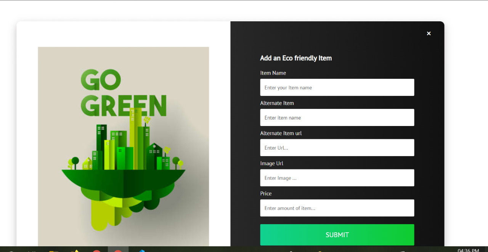

<h1 align="center">GreenALT</h1>

Cross Platform Browser Extension that suggests you sustainable alternatives on amazon

  

<!-- <h3 align="center">Made by <a href="https://github.com/mdb571">@mdb571⚡</a> & <a href="https://github.com/bmnidhin">@bmnidhin:rocket:</a></h3> -->

## How it works ?
-  <Insert Name> suggests you green alternatives when you try to buy something not sustainable from amazon
- Users can also submit green alternatives via the extension thus thereby contributing to our vision.
- The extension calculates the the amount of carbon footprint reduced when something greener is bought via the extension

## Libraries used
### Frontend
  - vanilaJs
  - React
  
### Backend
- flask 
- deta

Refer package.json and requirements.txt respectively for more details

## Setup
### Frontend
- `yarn install` to install dependencies.
- `yarn run dev:chrome` to start the development server for chrome extension
- `yarn run dev:firefox` to start the development server for firefox addon
- `yarn run dev:opera` to start the development server for opera extension
- `yarn run build:chrome` to build chrome extension
- `yarn run build:firefox` to build firefox addon
- `yarn run build:opera` to build opera extension
- `yarn run build` builds and packs extensions all at once to extension/ directory
  
  
  ### Development

- `yarn install` to install dependencies.
- To watch file changes in development

  - Chrome
    - `yarn run dev:chrome`
  - Firefox
    - `yarn run dev:firefox`
  - Opera
    - `yarn run dev:opera`

- Wait extention to build
- **Load extension in browser**

- ### Chrome

  - Go to the browser address bar and type `chrome://extensions`
  - Check the `Developer Mode` button to enable it.
  - Click on the `Load Unpacked Extension…` button.
  - Select your extension’s extracted directory.

- ### Firefox

  - Load the Add-on via `about:debugging` as temporary Add-on.
  - Choose the `manifest.json` file in the extracted directory

  
### Backend
- From `api` directory  
- Install the required python libraries `pip install -r requirements.txt`
- Set `FLASK_APP` environment variable to `main`
- run the server with `flask run`
- Now you can start sending requests from the frontend to the backend API

[Download Link](https://threadunni.tech) 
## Screenshots

  

 
  

  

 
  

  

 

  

 

## Contributing and Support

Feel free to open a pull request if you can help in improving this project.

## Licence

Code released under the [AGPL](LICENSE).
